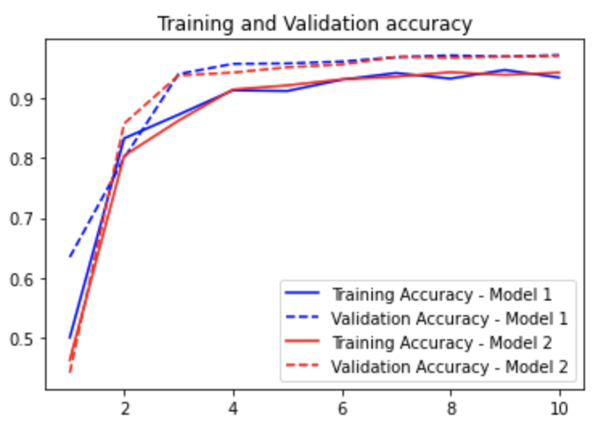
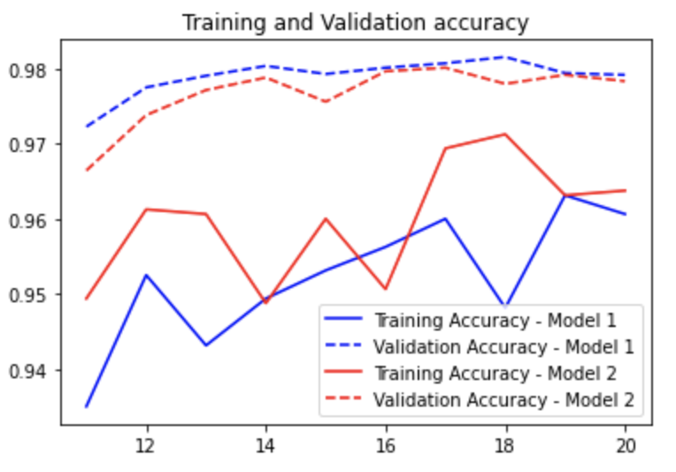
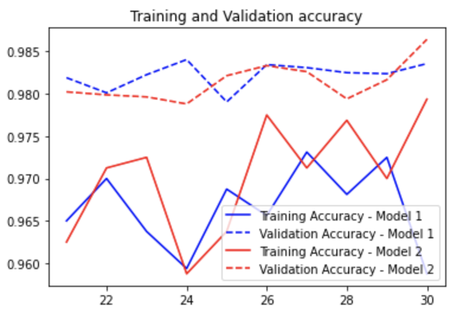
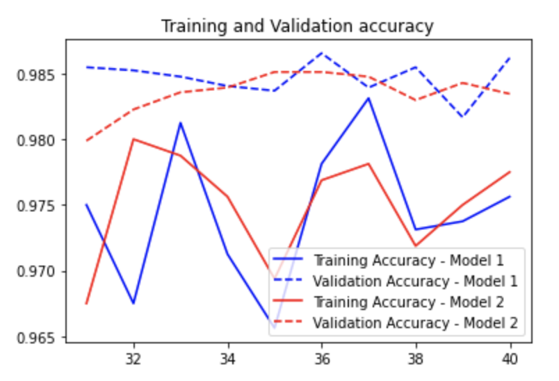

# maxpool_conv_comparison
Compare the performance of MaxPooling and Conv2D layers

The comparison is done by training two CNNs on the Digit Classification dataset on Kaggle, found [here](https://www.kaggle.com/c/digit-recognizer/data)

For more info on how the model was developed, refer [this](https://www.kaggle.com/cdeotte/how-to-choose-cnn-architecture-mnist)

## Model structure
The first model utilises a maxpool layer after two consecutive convolution layers. The second model utilises a convolution layer imitating the maxpool layer after two consecutive convolution layers.

- Each model was trained on a total of 40 epochs with an interval of 10 epochs. The images below show a comparison for epochs 1-10, 11-20, 21-30, 31-40

### Epochs 1-10

### Epochs 11-20

### Epochs 21-30

### Epochs 31-40

